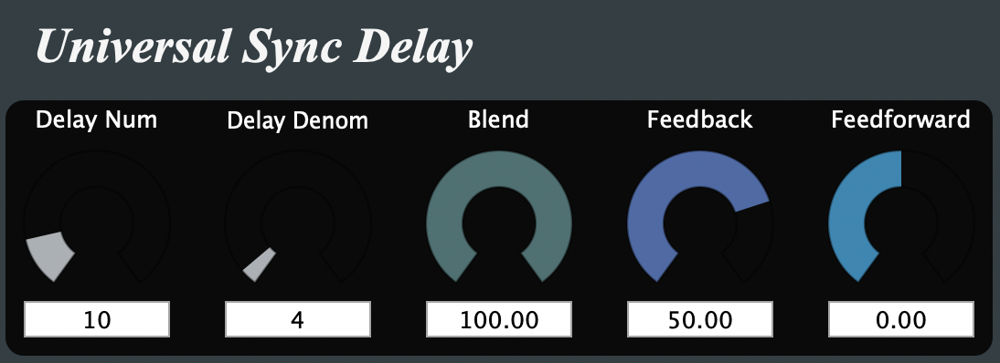

= UniversalSyncDelay 1.0
Matthieu Brucher <matthieu.brucher@gmail.com>
:doctype: book
:source-highlighter: coderay
:listing-caption: Listing
// Uncomment next line to set page size (default is Letter)
//:pdf-page-size: A4

*UniversalSyncDelay* is a free Open Source mono delay plugin with tempo synchronisation (maximum delay of 384000 samples).

== Usage

Here is how the parameters interact with the plugin:

[square]
* *delaynum* is the delay expressed as a number of ticks
* *delaydenom* is the delay fraction (4 is the quarter note default count)
* *blend* is the amount of delayed sound
* *forward* is the amount of direct sound
* *feedback* is the amount of sound to feedback in the delay line (strictly between -1 and 1)

== Bugs

There shouldn’t be bugs, but you never know. Please contact me or leave a message on http://www.audio-tk.com[Audio ToolKit web site] or on http://blog.audio-tk.com/tags/universalsyncdelay/[my blog, on the announcement page].
